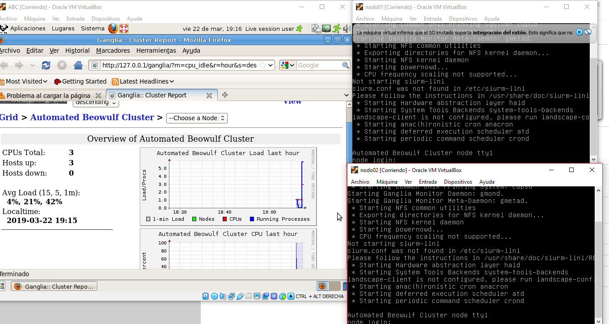
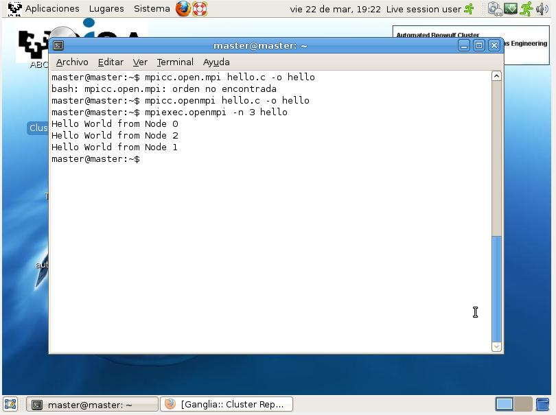

# EjercicioCluster
Lo primero que debemos hacer es descargarnos la ISO de linux ABC, que es compatible con clusters.
Podemos intalarlo, o iniciarlo en live. Una vez iniciado, procederemos a encender los nodos,
en este caso ordenadores sin sistema operativo, iniciandose desde la red.

Una vez arrancados, podemos ver si están funcionando correctamente, usando la aplicación de escritorio que
viene preinstalada en ABC, o haciendo uso de un script:

~~~
APLICACIÓN PREINSTALADA
~~~

~~~
SCRIPT
~~~

