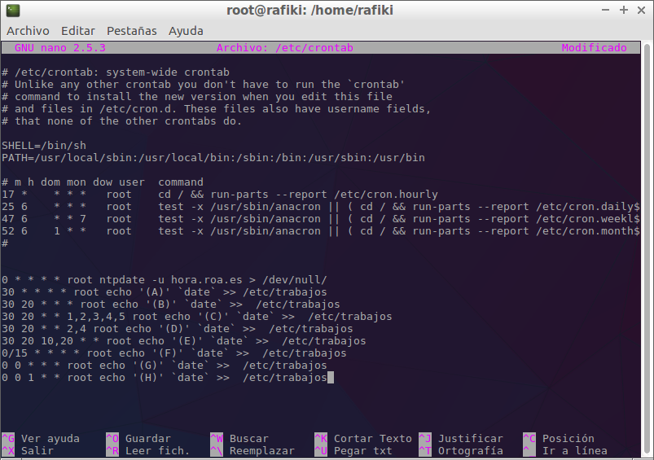

# Ejercicio CRONTAB:

### Para realizar el ejercicio, deberemos modificar el fichero /etc/crontab

Cada hora en punto ejecutamos la sincronización horaria y mandamos la salida a /dev/null/

~~~
0 * * * * root ntpdate -u hora.roa.es > /dev/null/
~~~

El trabajo que se debe ejecutar es:
Añadir al fichero /etc/trabajos (no existe hay que crearlo) el código del trabajo y la hora de ejecución.
~~~
touch /etc/trabajos
~~~

Programar un trabajo (A) para ejecutarse en el minuto 30 de cada hora de cada día.

~~~
30 * * * * root echo '(A)' `date` >> /etc/trabajos
~~~

Programar un trabajo (B) para ejecutarse cada día a las 20:30h.

~~~
30 20 * * * root echo '(B)' `date` >>  /etc/trabajos
~~~

Programar un trabajo (C) para ejecutarse de lunes a viernes a las 20:30h.

~~~
30 20 * * 1,2,3,4,5 root echo '(C)' `date` >>  /etc/trabajos
~~~

Programar un trabajo (D) para ejecutarse los martes y los jueves a las 20:30h.

~~~
30 20 * * 2,4 root echo '(D)' `date` >>  /etc/trabajos
~~~

Programar un trabajo (E) para ejecutarse los días 10 y 20 de todos los meses a las 20:30h.

~~~
30 20 10,20 * * root echo '(E)' `date` >>  /etc/trabajos
~~~

Programar un trabajo (F) para ejecutarse cada 15 minutos.

~~~
0/15 * * * * root echo '(F)' `date` >>  /etc/trabajos
~~~

Programar un trabajo (G) para ejecutarse cada día a las 00:00h.

~~~
0 0 * * * root echo '(G)' `date` >>  /etc/trabajos
~~~

Programar un trabajo (H) para ejecutarse cada primer día de mes a las 00:00h.

~~~
0 0 1 * * root echo '(H)' `date` >>  /etc/trabajos
~~~

### El fichero /etc/crontab deberá quedar así:

