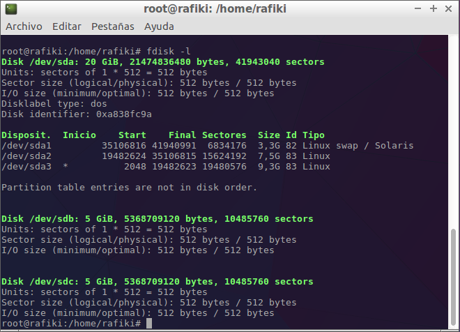
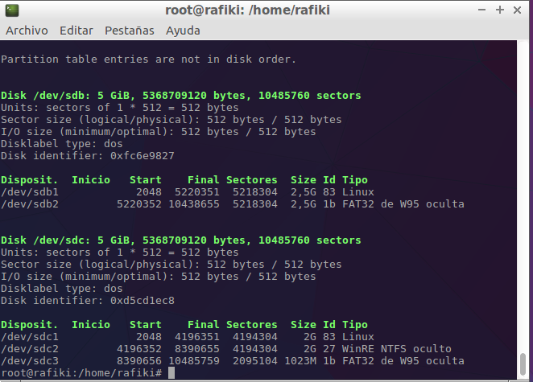
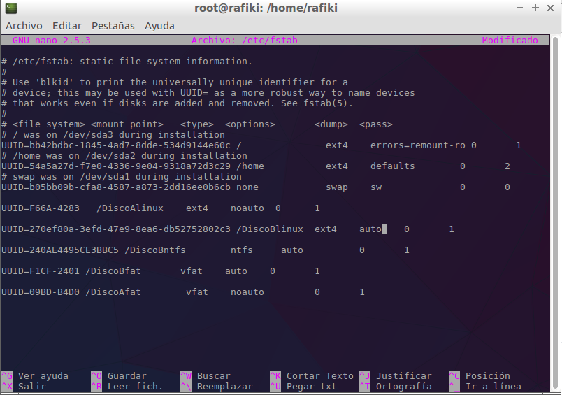

# Ejercicio Particiones
## Enunciado:
~~~
A una máquina virtual de linux añadirle dos discos duros:
- disco A
  - Crear las siguientes particiones:
    - Linux
    - Fat
- disco B
  - Crear las siguientes particiones:
    - Linux
    - NTFS
    - Fat   
Para particionar un disco nuevo y formatearlos se utiliza fdisk.  
Modificar el fichero fstab, añadiendo todas las particiones. Las del disco A se montarán manualmente. Las del disco B se montarán automáticamente al arrancar.  
~~~

### Particionado
Lo primero que debemos hacer, es logearnos como superusuario, y posteriormente mostrar los discos que tenemos conectados al disco duro:
~~~
fdisk -l
~~~

Después usremos el comando fdisk, junto a la ruta del disco. Mostraré un ejemplo del primer disco (DiscoA), haciéndole la primera partición (Linux), ya que con las demás es seguir los pasos de igual forma.
~~~
fdisk /dev/sdb
~~~

~~~
Welcome to fdisk (util-linux 2.27.1).
Changes will remain in memory only, until you decide to write them.
Be careful before using the write command.

El dispositivo no contiene una tabla de particiones reconocible.
Created a new DOS disklabel with disk identifier 0xfc6e9827.

Orden (m para obtener ayuda): n
Partition type
   p   primary (0 primary, 0 extended, 4 free)
   e   extended (container for logical partitions)
Select (default p): p
Número de partición (1-4, default 1): 1
First sector (2048-10485759, default 2048): 
Last sector, +sectors or +size{K,M,G,T,P} (2048-10485759, default 10485759): +2,5G

Created a new partition 1 of type 'Linux' and of size 2,5 GiB.

Orden (m para obtener ayuda): t
Selected partition 1
Partition type (type L to list all types): 83
Changed type of partition 'Linux' to 'Linux'.

Orden (m para obtener ayuda): w
The partition table has been altered.
Calling ioctl() to re-read partition table.
Syncing disks.
~~~

Primero indicamos una nueva partición (n), después que es del tipo primaria (p), el número de partición y por último el tamaño para esta partición. (si se quisiera todo el disco en una sola partición, bastaría con presionar enter).Hay que indicar el tipo de sistema de archivos que tendrá la partición, esto con el comando t, seguido del número de partición, y de un número hexadecimal que define el sistema de archivos. Si en vez del número hexadecimal, introducimos "L", nos mostrará el listado de estos números hexadecimales junto a su sistema de archivos correspondiente. Por último pulsamos "w" para guardar los cambios. Si no quisieramos guardar los cambios pulsaríamos "q" En este caso se dividirá el disco en más de una partición asi que repetiriamos lo anterior pero empezando en el siguiente cilindro disponible y sería la partición 2. 

Una vez lo hayamos realizado con todas las particiones, se quedaría algo así:

A continuación debemos crear los filesystem de cada partición. Para ello usaremos el comando mkfs:
~~~
mkfs -t ext4 /dev/sdb1   (creamos el filesystem de linux, ext4)
mkfs -t fat /dev/sdb2   (creamos el filesystem de fat, fat)

mkfs -t ext4 /dev/sdc1   (creamos el filesystem de linux, ext4)
mkfs -t ntfs /dev/sdc2   (creamos el filesystem de ntfs, ntfs)
mkfs -t fat /dev/sdc3   (creamos el filesystem de fat, fat)
~~~

Creamos los directorios donde posteriormente, montaremos los discos:
~~~
root@rafiki:/home/rafiki# mkdir /DiscoAlinux
root@rafiki:/home/rafiki# mkdir /DiscoAfat
root@rafiki:/home/rafiki# mkdir /DiscoBlinux
root@rafiki:/home/rafiki# mkdir /DiscoBntfs
root@rafiki:/home/rafiki# mkdir /DiscoBfat
~~~
Una vez creados los directorios necesitaremos modificar el fichero /etc/fstab

### Fichero /etc/fstab
En la primera linea se utiliza el UUID (Identificador Universal Único) del filesystem y en la segunda la ruta del mismo (no el punto de montaje). Si utilizamos el UUID, nuestro método sera mucho mas robusto.
Para obtener el UUID debemos ejecutar como root el siguiente comando:
~~~
root@rafiki:/home/rafiki# blkid /dev/sdb1 >> /etc/fstab
root@rafiki:/home/rafiki# blkid /dev/sdb2 >> /etc/fstab
root@rafiki:/home/rafiki# blkid /dev/sdc1 >> /etc/fstab
root@rafiki:/home/rafiki# blkid /dev/sdc2 >> /etc/fstab
root@rafiki:/home/rafiki# blkid /dev/sdc3 >> /etc/fstab
~~~
Este comando nos recoge el UUID de la particion y lo manda al final del fichero /etc/fstab.

Ahora modificamos el fichero fstab, añadiendo al final del UUID el punto de montaje, y los parámetros de la particion que vamos a montar:

Una vez modificado el fichero, pasaríamos a montarlos. Podemos hacerlo montandolo manualmente con el siguiente comando:
~~~
mount /dev/sdb1
mount /dev/sdb2

mount /dev/sdc1
mount /dev/sdc2
mount /dev/sdc3
~~~

Como están en el fichero /etc/fstab, podemos montarlos de la siguiente forma más cómodamente:
~~~
mount -a
~~~

Ya lo tendríamos todo funcionando.
